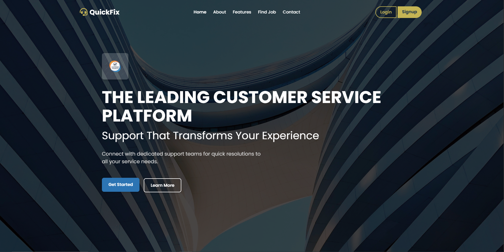

# 🛠️ QuickFix API

## 📄 Project Overview

QuickFix is a RESTful API connecting customers with service providers for home services like plumbing, woodwork, and electrical tasks. 

Customers post jobs with details such as category, description, location, budget, and preferred date/time. Providers, after admin approval, can accept and manage jobs through statuses like Pending, Accepted, In Progress, Completed, and Rejected. Admins manage users, jobs, and provider requests through a dashboard.

The system features JWT authentication, role-based access (CUSTOMER, PROVIDER, SUPER_ADMIN), in-app and email notifications, profile management with image uploads, pagination, filtering, and search.

## ⭐ Key Features

  ### 🔒 Authentication & Security
  - User registration/login with **JWT authentication**
  - Password hashing with **BCrypt**
  - Forgot/reset password via **email links**
  - Role-based access: **CUSTOMER, PROVIDER, SUPER_ADMIN**

 ### 📋 Roles & Provider Requests
  - Customers can request **PROVIDER** status
  - Admins can approve or reject requests
  - Notifications sent for request updates

  
  ### 🛠️ Job Management
  - Customers post jobs with **category, description, location, budget**
  - Providers browse and accept jobs
  - Update job statuses: **Pending → Accepted → In Progress → Completed**
  - Filter jobs by **category and status**

  ### 👤 Profile Management
  - Customers and providers can edit **personal details and bio**
  - Profile image uploads supported

  ### 🖥️ Admin Dashboard
  - Manage **users and jobs** with pagination, filters, and search
  - Approve/reject **provider requests**
  - View **job statistics**

  ### 🔔 Notifications
  - In-app notifications (**read/unread**)
  - Email alerts for **registration, job updates, and provider status**

  ### 💻 Frontend
  - Interactive dashboards for **Customer, Provider, and Admin**
  - Forms for **job posting, profile updates, and password reset**
  - Real-time updates using **JS Fetch API** and **SweetAlert** modals

## 🛠️ Technologies Used

- **Frontend:** HTML, CSS, JavaScript  
- **Backend:** Java 21, Spring Boot 3.5.4, Spring Security, Spring Data JPA, JWT, Lombok, JavaMailSender  
- **Database:** MySQL  
  - Entities: `User`, `CustomerProfile`, `ProviderProfile`, `Job`, `ProviderRequest`, `Notification`  
- **Other Tools:** Maven, MultipartFile (for image uploads), DTOs, Validation (`@Valid`), SweetAlert (for notifications)

## 📸 UI Screenshots

### 🖼️ Landing Page (index.html)

### 🖼️ About Section 

### 🖼️ Features Section

### 🖼️ Job Listings

### 🖼️ Testimonials

### 🖼️ Contact Form

### 🖼️ Login Page

### 🖼️ Signup Page

### 🖼️ Forgot Passowrd Page

### 🖼️ Reset Password Page

## 📸 Admin Dashboard UI Screenshots

### 🖼️ Dashboard Overview

### 🖼️ Manage Users Page

### 🖼️ Manage Jobs Page

### 🖼️ Notification Page

## 📸 Customer Dashboard UI Screenshots

### 🖼️ Dashboard Overview

### 🖼️ My Jobs Page

### 🖼️ Post Jobs Page

### 🖼️ Notification Page

### 🖼️ Profile Page

## 📸 Provider Dashboard UI Screenshots

### 🖼️ Dashboard Overview

### 🖼️ Available Jobs Page

### 🖼️ My Work Page

### 🖼️ Notification Page

### 🖼️ Profile Page

## ⚙️ Setup Instructions
  ### Prerequisites
  - Java 21 JDK (required for Spring Boot backend)
  - Spring Boot 3.x+ (included via Maven dependencies; no separate install needed)
  - MySQL 8.0+ (create database quickfix_db)
  - Maven 3.8+ (for building backend)
  - Git (for cloning the repository)

# Backend Setup (Spring Boot)

### 1. Clone the repository
      git clone https://github.com/your-username/quickfix-api.git
      cd quickfix-api/backend
### 2. Naviagte
      cd quickfix-api/backend
### 3. Create uploads folder and copy default profile image
      mkdir uploads
      cp frontend/images/default-profile.png uploads/
### 4. Configure
      application.properties
  Edit src/main/resources/application.properties and set:
  - Database:

        spring.datasource.url=jdbc:mysql://localhost:3306/quickfix_db
        spring.datasource.username=YOUR_DB_USERNAME
        spring.datasource.password=YOUR_DB_PASSWORD
        spring.jpa.hibernate.ddl-auto=update
        spring.jpa.show-sql=true

   - JWT secret, mail host, port, username, password, etc:

         jwt.secretKey=your-secure-key (256-bit)
         jwt.expiration=86400000

         spring.mail.host=smtp.gmail.com
         spring.mail.port=587
         spring.mail.username=your-gmail@gmail.com
         spring.mail.password=your-app-password
         spring.mail.properties.mail.smtp.auth=true
         spring.mail.properties.mail.smtp.starttls.enable=true

### 5. Build and run backend
      mvn clean install
      mvn spring-boot:run
### 6. API base URL: http://localhost:8080/api

# Frontend Setup
  The frontend is static HTML/CSS/JS. You can serve it via Spring Boot:
  
  - Access pages like /index.html, /login.html directly from the backend.
      - Key files:
          - `index.html`: Home
          - `login.html`: Login form
          - `customerDashboard.html`: Job posting/list
          - `providerDashboard.html`: Job browsing/acceptance
          - `adminDashboard.html`: Admin management
          - `js/scripts.js`: API calls, JWT handling
          - `css/styles.css`: Styling 
  
  - For development

        cd ../frontend
        npx http-server -p 8081

      - `http://localhost:8081`. Configure `js/scripts.js` for API calls to `http://localhost:8080/api`.
   
 # Database Setup

 ### 1. Create database
     CREATE DATABASE quickfix_db;

### 2. Tables
  - JPA/Hibernate will auto-create all required tables when the backend starts.
      - (`users`, `jobs`, `customer_profile`, etc.).

### 3. Seed SUPER_ADMIN user
  - You can create the admin via API:

        POST http://localhost:8080/api/auth/register
  - Request body example (JSON):

        {
          "username": "admin",
          "email": "admin@example.com",
          "password": "your_secure_password",
          "role": "SUPER_ADMIN"
        }
      - Backend will hash the password automatically.
   
  - Or insert manually via SQL (make sure to hash the password):

        INSERT INTO users (username, email, password, role, enabled)
        VALUES ('admin', 'admin@example.com', 'hashed_password_here', 'SUPER_ADMIN', true);

 
## 🔗 API Endpoints

### Authentication /api/auth

  - POST /register – Register user
  - POST /login – Login and receive JWT
  - POST /forgot-password – Request password reset
  - POST /reset-password – Reset password with token

### Profiles /api/profile

  - GET /customer/{userId} – Get customer profile
  - PUT /customer/{userId} – Update customer profile
  - GET /provider/{userId} – Get provider profile
  - PUT /provider/{userId} – Update provider profile
  - GET /image/{filename} – Serve profile image

### Jobs /api/jobs

  - POST /post-job – Post job (Customer)
  - GET /my-jobs – Customer jobs
  - GET /available-jobs – Pending jobs for providers
  - POST /accept/{jobId} – Accept job
  - POST /start/{jobId} – Set job in progress
  - POST /complete/{jobId} – Complete job
  - GET /my-work – Provider jobs
  - GET /all – All jobs (Admin)
  - POST /reject/{jobId} – Reject job (Admin)

### Admin /api/admin

  - GET /pending-requests – Pending provider requests
  - POST /approve-requests/{id} – Approve request
  - POST /reject-request/{id} – Reject request
  - GET /all/users – Paginated users list
  - GET /all/jobs – Paginated jobs list
  - GET / users/{id} - single user details

### Customer /api/customer

  - POST /request-provider – Request provider role

### Notifications /api/notifications

  - GET /unread – Unread notifications
  - GET /all – All notifications
  - POST /mark-read/{id} – Mark as read
  - POST /mark-all-read – Mark all read
  - POST /mark-unread/{id} - Mark single unread
  - GET /unread-count - Unread count

## 📁 Folder Structure
    quickfix-api/
    ├── frontend/
    │   ├── css/
    │   ├── js/
    │   ├── images/
    │   ├── screenshots/
    │   ├── index.html
    │   ├── login.html
    │   ├── customerDashboard.html
    │   ├── providerDashboard.html
    │   ├── adminDashboard.html
    │   ├── forgotPassword.html
    │   ├── resetPassword.html
    ├── backend/
    │   ├── src/main/java/org/examples/quickfixapi/
    │   │   ├── config/
    │   │   ├── controller/
    │   │   ├── dto/
    │   │   ├── entity/
    │   │   ├── exception/
    |   |   ├── security/
    │   │   ├── respository/
    │   │   ├── service/
    │   │   └── util/
    │   ├── src/main/resources/application.properties
    │   ├── uploads/
    │   ├── pom.xml
    ├── README.md

## 🚀 Future Enhancements

  - Add location filtering param to `/api/jobs/available-jobs`.
  - Implement reviews/ratings.
  - Add endpoint tests with @WebMvcTest.
  - Upgrade frontend to React.

## 📧 Contact
  ##### Yashoda Gunawardhana
  ##### Email: yashodagunawardhana15@gmail.com
